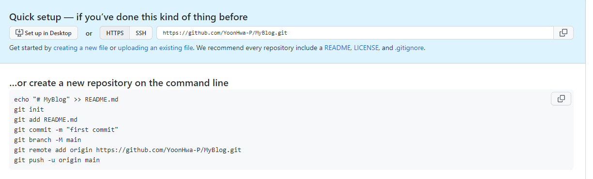

# 21.10.28
21.10.28_학원 수업
 

#뭘 배울까

 <h4> 깃허브 프로그램 프레임워크 </h4>

    1. Jdkyll

    2. Hugo

    3. Hexo : 한글로 정리 된 자료가 많아서 입문 하기 쉬움  
            따라서 Hexo로 블로그를 만들어 보자 

 

    먼저 node.js 를 설치 해 줘야 한다. 
    왜 설치하는지 모르겠지만 나중에 알아보기로 한다. 
    설치 중간에 Add to path 꼭 확인 하고 
    chocolately 박스를 꼭 체크 해 준다. 

<h3> hexo install  </h3>
    getbush를 바탕화면에서 열어준다.  
Hexo 의 경우   

 >$ npm install -g hexo cli
 

위의 코드를 치면 install 됨.

    
<h3> hexo install conf  </h3>

    $ npm 

설치가 됬는지 확인 

    $ node -v

설치된 node의 version 확인 

 
 

Hexo init를 하여 MyBlog를 만들어 보자 
2개의 저장소를 만들자.  
    1) 리소스 저장소 **(my blog)**  
        * 강사님 블로그에는 버전관리용과 배포용 관리로 적혀있다.   
    2)배포 **(github.io)**  
    
 

- github에서 Myblog repository create
  
 
- command line으로 저장소 생성 해 보자
$ git clone **_your_git_repo_address.git_**

    **_your_git_repo_address.git_** : 나의 주소를 넣어야 한다. 
- 

https://ppoffice.github.io/hexo-theme-icarus/uncategorized/getting-started-with-icarus/#install-npm

     npm install -S hexo-theme-icarus

my blog에  설치 

    theme: icarus

 
 

Node 설치 https://nodejs.org/ko/download/  
hexo google analytics 연동하기  
https://hongdonghyun.github.io/2019/11/Hexo-Google-Analytics-%EC%97%B0%EB%8F%99%ED%95%98%EA%B8%B0/
= 

 
 <h3> 오늘 배운거 복습 :</h3>
https://dschloe.github.io/settings/hexo_blog/